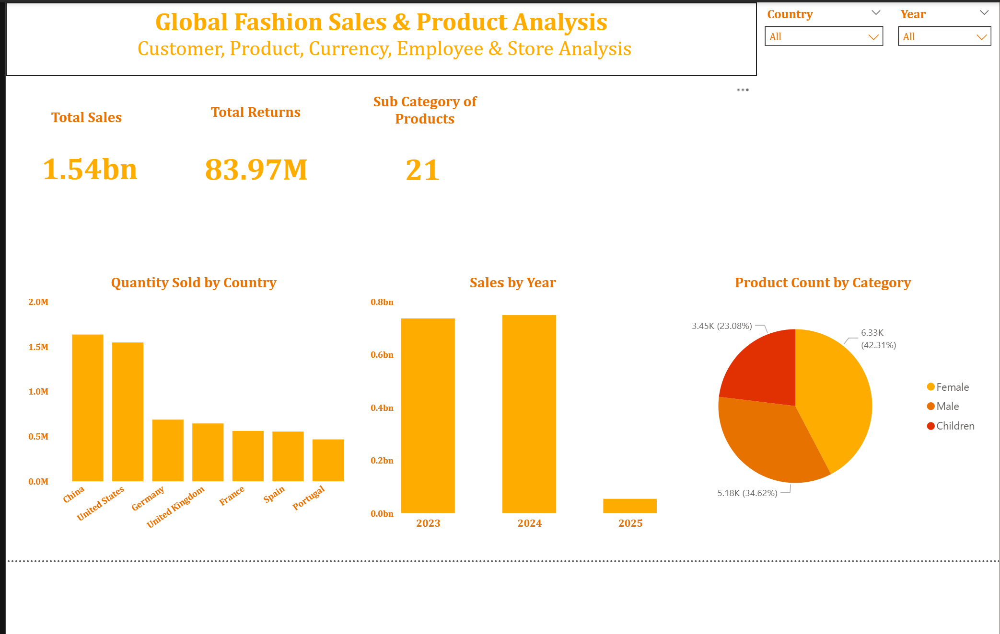
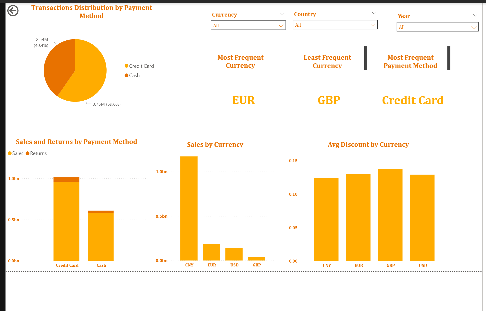
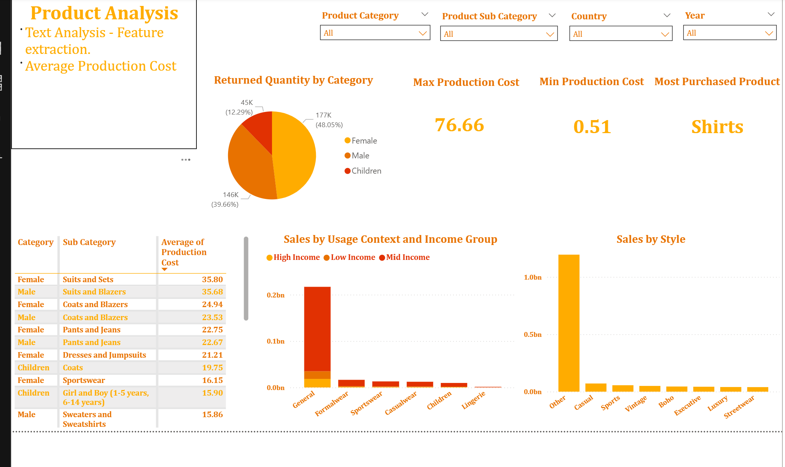

# 🌍 Global Fashion Retail Analytics Dashboard

## 🎯 Objective
To analyze **global fashion retail performance** across multiple countries and product categories using Power BI.  
The dashboard provides insights on sales, returns, product performance, customer demographics, and currency trends to support data-driven retail decision-making.

---

## 🧰 Tools & Technologies
- **Power BI** – Data modeling, DAX calculations, visualization  
- **Excel / CSV** – Source data for products, customers, transactions  
- **Power Query** – Data cleaning and transformation  
- **DAX** – KPI creation, time intelligence, calculated measures  

---

## ⚙️ Data Model Overview
The project uses a **star schema** for high query performance and maintainability.

**Fact Table:**  
- `Transactions`: Captures transaction-level details (quantity, amount, returns, discount, currency, payment mode)

**Dimension Tables:**  
- `Customers`: Demographics, age group, income category, segment  
- `Products`: Product and subcategory, style, cost  
- `Stores`: Country, region  
- `Currency`: Exchange rates and currency type
- `Employees`: Demographics
- `Discounts`: Amount, categories, and subcategories.  

---

## 📈 Dashboard Sections

### **1️⃣ Overview Page**
- KPIs: **Total Sales (1.54B)** | **Total Returns (83.97M)** | **Subcategories (21)**  
- Charts:  
  - Quantity Sold by Country (Top: China, USA)  
  - Sales by Year (2023–2025)  
  - Product Count by Category (Female / Male / Children)  

### **2️⃣ Customer Analysis**
- Segmentation by demographic and income group  
- KPIs: **Total Customers (1.64M)** | **Repeat Rate (0.74)**  
- Visuals:  
  - Customer Count by Segment (Lapsed, At Risk)  
  - Quantity Sold by Income Group  
  - Sales by Age and Gender  

### **3️⃣ Currency & Payment Analysis**
- Transactions split by **payment method** (Credit Card, Cash)  
- Insights:  
  - Sales vs. Returns by payment method  
  - Sales by Currency (CNY, EUR, USD, GBP)  
  - Avg. Discount % by Currency  
- Highlights the most and least frequent currencies and payment methods  

### **4️⃣ Product Analysis**
- KPI cards for **Max/Min Production Cost** and **Most Purchased Product (Shirts)**  
- Returned Quantity by Category (Female ~48%)  
- Cross-tab view of categories and average production cost  
- Sales trends by **Usage Context, Income Group, and Style**  

---

## 📊 Key Insights
- **China and USA** drive over 60% of total global sales.  
- **Credit Card transactions** dominate with ~60% share.  
- **Casualwear** and **high-income customers** generate the majority of revenue.  
- **Women’s categories** show higher return rates but also contribute the highest sales volume.  
- **CNY** is the dominant transaction currency.

---

## 🖼️ Dashboard Preview
Below are sample screenshots from the Power BI dashboard:

| Page | Description |
|------|--------------|
|  | Overview with global KPIs and country-wise sales |
|  | Customer segmentation and demographics |
|  | Payment method and currency-based trends |
|  | Category-wise cost, returns, and style insights |

---

## 📁 Folder Structure
| Folder | Description |
|---------|--------------|
| `/data` | Cleaned retail dataset used for dashboard |
| `/powerbi` | Dashboard screenshots (.png) |
| `/docs` | Optional project report or .pbix file |

---

**Author:** [Prajakta Deshpande](https://linkedin.com/in/prajakta-deshpande)  
📧 Contact: ppdpune@gmail.com  
📍 Gujarat, India (Open to Remote / Relocation)
